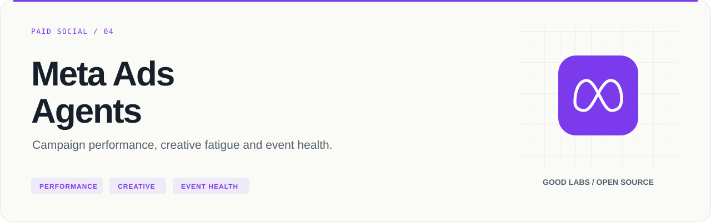
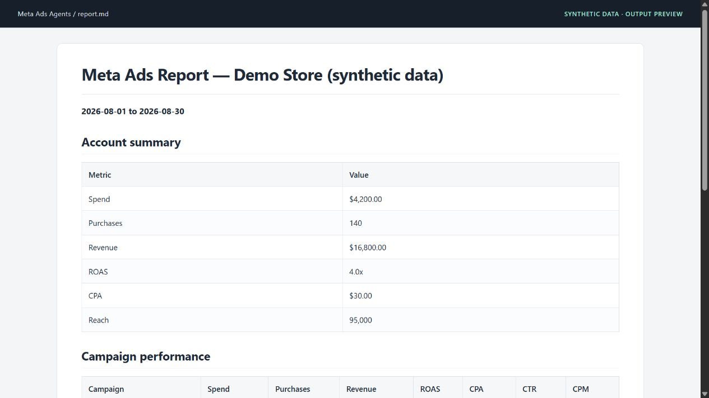

<p align="center">
  
</p>

# Meta Ads Agents

Campaign performance, creative fatigue and event health.

[](https://github.com/arcbaslow/meta-ads-agents/actions/workflows/tests.yml)
[](https://github.com/arcbaslow/meta-ads-agents/releases)
[](#installation)
[](LICENSE)

[Quick start](#quick-start) · [Example output](#example-output) · [Tests](#tests) · [Releases](#releases) · [Contributing](CONTRIBUTING.md)

A read-only Python toolkit for Facebook and Instagram advertising analysis. Retrieve Marketing API data, inspect campaign and creative performance, and combine specialist findings into reports through the `/meta-ads` agent workflow.

## What you can do

| Area | Included capabilities |
| --- | --- |
| Performance | Spend, purchases, revenue, ROAS, CPA, CTR and frequency at campaign, ad-set and ad level |
| Creative | Creative metadata, metrics, and per-ad fatigue scored from frequency, CTR change and CPM drift over the period |
| Audiences | Age, gender, geography, device and placement breakdowns |
| Measurement | Pixel/CAPI event health and conversion-funnel checks |
| Budget | Agent analysis of utilization, pacing and bid-strategy fit |
| Change history | Activity log lined up with each entity's metrics before and after a change |
| Delivery | Stalled ad sets: caps below the account's real CPA, learning phase status, budgets too small for the optimisation event |
| Reports | Markdown, HTML, PDF, CSV tables and period comparisons |

The adapters retrieve data; specialist agents interpret it. The complete audit is an agent skill, not a standalone `meta_audit.py` command. Account mutation is not implemented.

## Installation

Requires **Python 3.10+**, a Meta app and access to the ad account. See [docs/SETUP.md](docs/SETUP.md) for app setup and permissions.

```bash
git clone https://github.com/arcbaslow/meta-ads-agents.git
cd meta-ads-agents
python -m venv .venv
```

Activate with `source .venv/bin/activate` on macOS/Linux or `.venv\Scripts\Activate.ps1` in Windows PowerShell, then:

```bash
python -m pip install -e ".[dev]"
```

Run the adapters from the cloned repository. The project is distributed as an agent toolkit; the source tree includes the scripts, reference material and skill definitions needed for that workflow.

## Quick start

Configure credentials using the OAuth browser flow:

```bash
python scripts/meta_auth.py --oauth --app-id YOUR_APP_ID --app-secret YOUR_APP_SECRET
python scripts/meta_auth.py --check
python scripts/meta_auth.py --accounts
```

The callback listens on `localhost:8477`. For environments where that flow is unavailable, use the manual configuration path documented in [setup](docs/SETUP.md). Credentials are stored locally in `~/.claude/meta-ads-credentials.json`; never commit that file.

To run without a credentials file, for example in CI or on a schedule, set `META_ACCESS_TOKEN`. When it is set the adapters use it and do not read the file.

Replace the example account ID with one returned by `--accounts`:

```bash
python scripts/meta_insights.py --account act_123456789 --days 30
python scripts/meta_creatives.py --account act_123456789 --with-metrics
python scripts/meta_events.py --account act_123456789 --health-check
```

Both `123456789` and `act_123456789` are accepted and normalized to `act_123456789`. Data adapters print JSON to stdout.

## Example output



This screenshot shows the actual Markdown report rendered for documentation, with **synthetic campaign data**. Reproduce it without a Meta account:

```bash
python scripts/meta_report.py --input examples/demo/account.json --format md --output report.md
python scripts/meta_report.py --input examples/demo/account.json --format html --output report.html
```

Read the [generated report](examples/demo/report.md) or inspect the [report input](examples/demo/account.json). The report input is an assembled report object, not the raw response from `meta_insights.py`.

## Agent workflow

With the repository's [plugin](.claude-plugin/plugin.json) and [skills](skills/) loaded, the [router](skills/meta-ads/SKILL.md) provides:

```text
/meta-ads audit act_123456789
/meta-ads performance act_123456789
/meta-ads creative act_123456789
/meta-ads audience act_123456789
/meta-ads events act_123456789
/meta-ads budget act_123456789
/meta-ads delivery act_123456789
/meta-ads changes act_123456789
```

The audit skill distributes work across the specialists in [agents/](agents/), then combines their findings. Other agent runtimes can follow [AGENTS.md](AGENTS.md) and run the underlying adapters directly.

## Reports and comparisons

```bash
python scripts/meta_insights.py --account act_123456789 --level adset --breakdown age --days 30
python scripts/meta_report.py --input examples/demo/account.json --format pdf --output report.pdf
python scripts/meta_report.py --input examples/demo/account.json --format csv --output csv-output
python scripts/meta_report.py --input current.json --compare previous.json --format md --output comparison.md
```

Campaign queries typically use 30 days; event checks use 7. Inspect the adapter's `--help` for overrides. Benchmark reference files in [skills/meta-ads/references/](skills/meta-ads/references/) support interpretation; they are bundled reference material, not continuously updated market data.

### Creative fatigue

```bash
python scripts/meta_creatives.py --account act_123456789 --fatigue --days 14
```

Compares each ad's CTR and CPM in the second half of the period with the first half, reads its frequency for the period, and labels it `fatigued`, `near_fatigue` or `ok` with a rotation recommendation. Ads with fewer than `--min-impressions` (default 1000) in either half are listed as not scored.

### Delivery diagnosis

```bash
python scripts/meta_delivery.py --account act_123456789 --days 7
```

Lists active ad sets that Meta reports an issue on, that served nothing, or that underspend, and checks three causes: a bid or cost cap below the account's cost per optimisation event, learning limited status, and a weekly budget that buys fewer events than the learning phase needs. Findings are sorted and carry their evidence, so two runs on the same data produce the same output. Checks that cannot run are listed under `not_evaluated` with the reason.

### Change history

```bash
python scripts/meta_changes.py --account act_123456789 --days 14 --window 3
python scripts/meta_changes.py --account act_123456789 --level ad --action-type offsite_conversion.fb_pixel_purchase
```

Reads the ad account activity log and daily insights, and for every change to a campaign, ad set or ad compares spend per day, CPM and CTR (and CPA, when an action type is given) over the days before and after it. Changes followed by a move of 30% or more are listed first. This is a before and after comparison: it shows what moved together, not what caused it.

### Caching and API behavior

Responses use a 15-minute JSON cache under the OS temporary directory, in `claude-meta-ads/`. Pass `--no-cache` to refresh a supported adapter query. Retryable rate-limit errors and transient connections use exponential backoff. Field availability still depends on the account, permissions and API version. Fatigue and event-health signals are heuristics to investigate, not proof of a cause.

## Tests

```bash
python -m ruff check scripts/
python -m pytest scripts/ -q
```

The fixture-based suite requires no Meta account and covers auth and OAuth state validation, cache behavior, campaign and audience queries, creative scoring, event health, report formats, agent-command parsing and version consistency. CI runs Python 3.10–3.13. See the [release verification](docs/VERIFICATION.md).

## Repository map

| Path | Purpose |
| --- | --- |
| [scripts/](scripts/) | Marketing API adapters, reports and tests |
| [agents/](agents/) | Performance, creative, audience, events and other specialists |
| [skills/](skills/) | `/meta-ads` commands and analysis reference material |
| [examples/demo/](examples/demo/) | Synthetic report input and generated Markdown |
| [docs/](docs/) | App setup, releases, verification and the [roadmap](docs/ROADMAP.md) |

## Releases

**[v1.1.0](https://github.com/arcbaslow/meta-ads-agents/releases/tag/v1.1.0)** — see the [release notes](docs/RELEASE_NOTES.md) for this release and the [changelog](CHANGELOG.md) for project history.

GitHub Releases include downloadable artifacts and checksums. Package-registry publication is a separate, opt-in workflow; a GitHub release does not imply that the same version is available on PyPI or npm. Maintainers can follow the [release guide](docs/RELEASING.md).

## Contributing

Read [CONTRIBUTING.md](CONTRIBUTING.md), run the checks above, and include a minimal reproduction for bugs. Report vulnerabilities through [SECURITY.md](SECURITY.md).

## Related tools

| Project | Use it for |
| --- | --- |
| [Google Ads Agents](https://github.com/arcbaslow/google-ads-agents) | Paid media audits, tracking checks and reviewed changes. |
| [Google Analytics Agent](https://github.com/arcbaslow/google-analytics-agent) | GA4 data quality, funnels and property management. |
| [Search Console Agent](https://github.com/arcbaslow/google-search-console-agent) | Search performance, indexing and page experience. |
| [GTM Diff](https://github.com/arcbaslow/gtm-diff) | Review the changes in your Google Tag Manager exports. |
| [Figma Taxonomy Gen](https://github.com/arcbaslow/figma-taxonomy-gen) | Turn interactive designs into a reviewable tracking plan. |

Maintained by [Good Labs](https://goodlabs.kz) — measurement implementation, tracking plans and analytics audits.

## License

[MIT](LICENSE) © Dilshat Rakhimov. This is an independent project; it is not an official product of the platform vendors.
